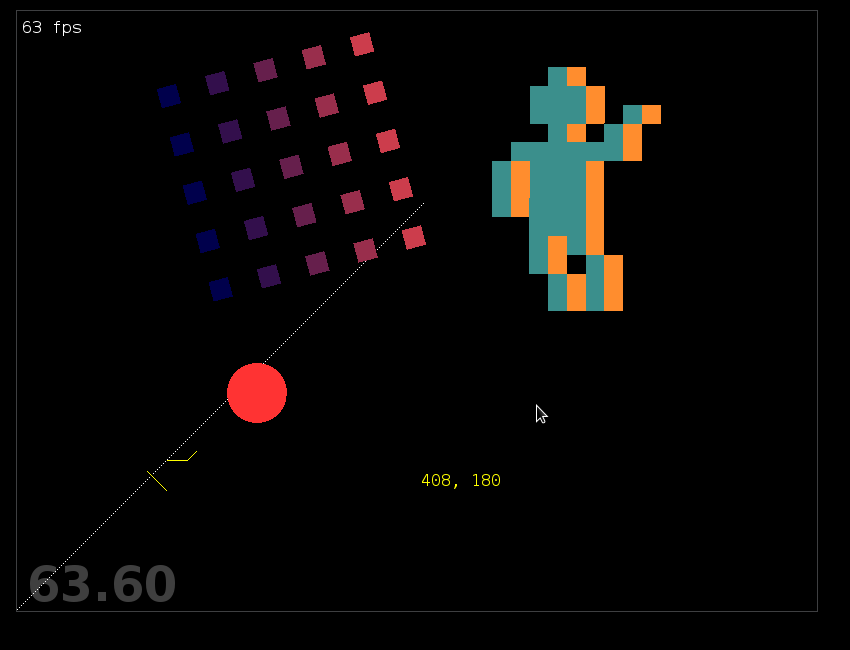

# Pyglet Game Layout

This game layout allows to use `pyglet` in combination with a typical
game class (here: `App`) that can then be used as central point to combine
maps, entity hierarchies and other game tropes.

Also, it demonstrates graphics, sound and OpenGL usage in `pyglet` in one
single file.

